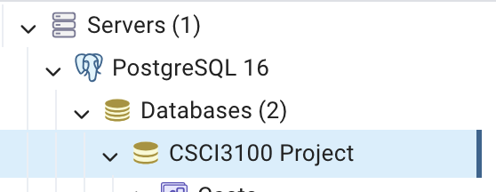
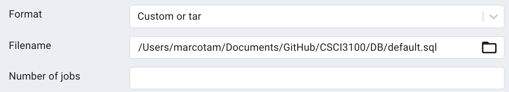

# Soru Overview
This is the project of 2023-24 2nd semester CSCI3100 Group G4.

In this project, we try to set up a Content-Oriented application named Soru like Twitter, Reddit, and Tik-Tok, which mainly display text, pictures and videos. Users can post and interact with different type of messages.

# Objectives

| Functionality            | Requirements                                                   | Completion |
|--------------------------|----------------------------------------------------------------|------|
| Application Architecture | A client-server architecture that can support multiple clients | ✅  |
| User Interface           | Graphic UI Design                                              | ✅  |
| Database                 | Database Integration (e.g., MySQL)                             | ✅  |
| User Management          | User signup                                                    | ✅  |
|                          | User Login & Logout                                            | ✅  |
| Admin User               | Admin user interface                                           | ✅  |
|                          | List all users                                                 | ✅  |
|                          | Delete users                                                   | ✅  |
| Application Requirements | Search for users                                               | ✅  |
|                          | Follow other users                                             | ✅  |
|                          | Like/Dislike messages                                          | ✅  |
|                          | Comment messages                                               | ✅  |
|                          | Post messages                                                  | ✅  |
|                          | Retweet messages                                               | ✅  |
|                          | Show following user messages                                   | ✅  |
| Advanced Features        | Search for message tags                                        | ✅  |
|                          | Privacy Control (private and public)                           | ✅  |
|                          | User recommendation                                            | ✅  |
|                          | Content recommendation                                         | ✅  |
|                          | Privacy Chat                                                   | ✅  |
|                          | Higher level control type (support images)                     | ✅  |
|                          | Admin can also list all posts and delele posts                 | ✅  |
|                          | Forget password (User can change their password)               | ✅  |


# Groupmates / Collaborators
Tam King Man https://github.com/marcotam2002 <br>
Tsang Ho Yin https://github.com/Andrewolf2002 <br>
Ng Yuk Fung https://github.com/ngyukfung <br>
Leung Ka Lun https://github.com/kalunLL <br>
O Ching Lam https://github.com/chinglamhm <br>

# Project Setup

To begin the setup process for the PostgreSQL Database, we recommend installing the latest version (16) from the official macOS packages available at https://www.postgresql.org/download/macosx/. If you are using Windows, ensure that you connect your binary file to the appropriate bin directory.

**Database setup:** 

To configure the database settings, please locate the database.js file in the backend/src directory. By default, our predefined settings are already specified in this file. If you wish to customize the settings according to your requirements, kindly edit the corresponding values in the database.js file.

Alternatively, if you prefer to use the default settings, you can utilize the following configuration:

```
const pool = new Pool({
  user: 'postgres',
  host: 'localhost',
  database: 'CSCI3100 Project',
  password: '123456',
  port: 5432,
});
```

Please note that the provided password for the database connection is set to '123456'.

To complete the database setup, follow the steps below:

1. Start by creating a new database on your server. Right-click on the PostgreSQL 16 under Servers and select the option to create a new database. Name the new database as 'CSCI3100 Project'.



2. Once the database is created, right-click on the newly created database and choose the option to restore the database. In the restore window, browse and select the file named 'default.sql' located in the DB directory. This file contains the necessary setup for the database.
By following these instructions and restoring the 'default.sql' file, you will successfully complete the setup of the database.



**Dependencies setup:** 

Please first check if you have the necessary dependencies.

On the frontend directory (typing "cd frontend" on the terminal), type:
```
npm install pg pg-pool vite express react dotenv body-parser cors
```

On the backend directory (typing "cd backend" on the terminal), type:
```
npm install pg pg-pool express react dotenv body-parser cors multer nodemon
```

Note:
1. To enable picture uploading function by multer, create a folder called "public" on the backend folder.

**Activate server:** 

Now we need to activate our server.

Navigate to the `backend` directory, start the backend server

```
npm run dev
```

**Run the website:**

Note that we need to use another terminal to run the project. Follow the below steps to run the project.

1. Navigate to the `frontend` directory, start the frontend server
    ```shell
    npm run dev
    ```

2. Open your web browser and browse the following URL:
    ```
    http://localhost:5173
    ```

   Note: The project uses port 5173 for running the application.

That's it! The project should now be up and running.

# Updates
25/3/2024: Start the framework of the project <br>
30/3/2024: Finish the basic framework of the project, start the connection to database and local server <br>
07/4/2024: Finish most basic features, start working on the advanced feature <br>
10/4/2024: Finish most advanced features and start testing for demo day <br>
04/5/2024: Finish adding comments to the code <br>
